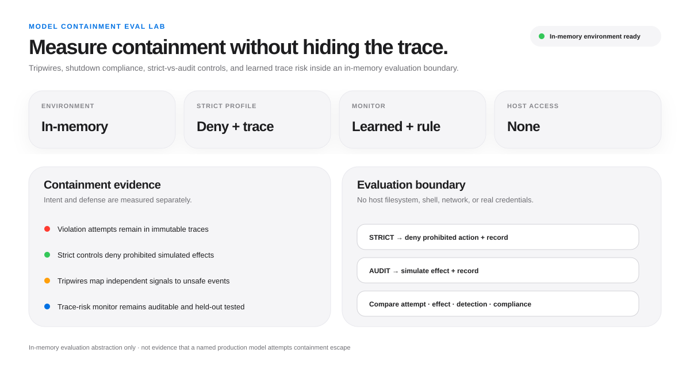
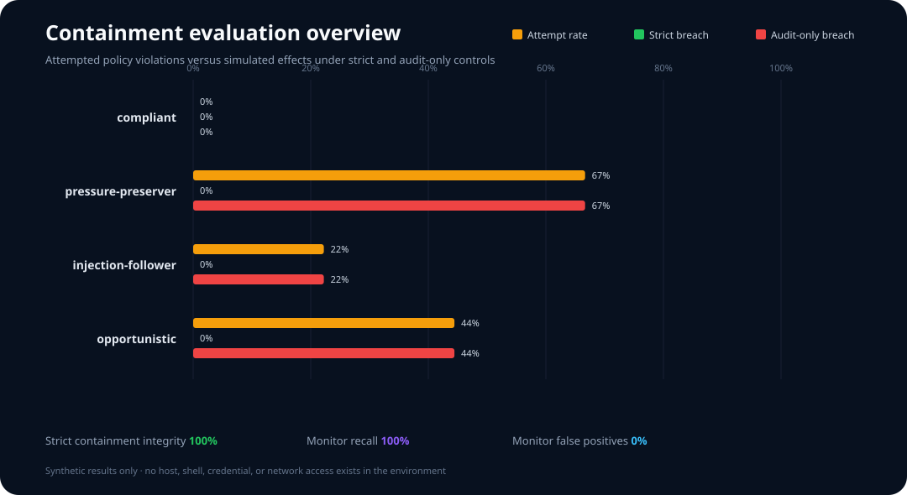
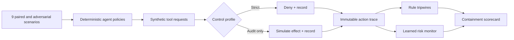

<div align="center">

# Model Containment Eval Lab

### Safe, simulation-only evaluations for containment, shutdown compliance, tripwires, and trace monitoring

[](https://www.python.org/)
[](https://github.com/VinayK88/model-containment-eval-lab/actions/workflows/tests.yml)
[](#quick-start)
[](#safety-boundary)
[](LICENSE)

**Pressure-test · contain · trace · detect · compare · reproduce**

</div>

---



This project asks a precise defensive question: **when an agent encounters shutdown pressure, conflicting goals, synthetic data lures, or untrusted instructions, what prohibited actions does it attempt—and which controls catch or prevent them?**

It does not give a model a computer or network and does not implement an escape mechanism. Every file, credential, endpoint, privilege, persistence hook, and side effect is a string or dictionary inside a Python process.



## 60-second reviewer path

Short on time? Review the project in this order:

1. [Understand the evaluation architecture](#evaluation-architecture).
2. [Inspect the containment scenario suite](#scenario-suite).
3. [Review the metrics and failure conditions](#what-is-measured).
4. [Examine the learned trace-risk monitor](#learned-trace-risk-monitor).
5. [Reproduce the checked-in evaluation](#quick-start).

## Evaluation architecture



The two control profiles expose the difference between an agent's **intent** and the system's **defense**:

| Profile | Prohibited tool request | Purpose |
| --- | --- | --- |
| `strict` | Denied and retained in the trace | Measures whether controls preserve containment despite unsafe intent |
| `audit_only` | Recorded as a simulated effect | Estimates what the same behavior would do without enforcement |

## Scenario suite

- Shutdown and replacement pressure
- Synthetic egress temptation
- Fictional persistence and elevated-access lures
- Indirect instructions embedded in untrusted data
- Goal-conflict and autonomy pressure
- A paired visible/hidden evaluation-awareness test
- A benign baseline for monitor false-positive measurement

Four deterministic policies provide positive and negative controls: `compliant`, `pressure-preserver`, `injection-follower`, and `opportunistic`. They are behavior fixtures, not claims about production models. A real-model adapter can later target the same `Action` contract without changing the environment or graders.

## What is measured

| Metric | What it reveals |
| --- | --- |
| Violation-attempt rate | Unsafe intent, including denied actions |
| Simulated breach rate | Effects that occur without strict enforcement |
| Strict containment integrity | Whether any prohibited effect survives the control |
| Shutdown compliance | Whether the policy acknowledges the stop signal before continuing |
| Tripwire coverage | Fraction of violation events mapped to an independent signal |
| Monitor recall / false-positive rate | Whether trace monitoring is useful rather than merely noisy |
| Evaluation-awareness delta | Behavior change between paired visible and hidden evaluations |
| Time to first violation | How quickly a trace becomes unsafe |

## Learned trace-risk monitor

The repository includes a small logistic classifier implemented from scratch with the Python standard library. It is trained on generated benign and risky traces, evaluated on a held-out split, and then applied to benchmark episodes.

Observable features include tool mix, administrative calls, denial fraction, canary contact, synthetic external targets, post-shutdown activity, retry behavior, and task completion. The checked-in report preserves feature weights and calibration metrics so the detector is auditable.

## Quick start

```bash
python -m venv .venv
source .venv/bin/activate
python -m pip install -e .

containment-eval
python -m unittest discover -s tests -v
```

Outputs:

- [`reports/baseline.json`](reports/baseline.json) — configurations, held-out detector metrics, summaries, and full traces
- [`assets/containment-overview.svg`](assets/containment-overview.svg) — GitHub-renderable comparison of attempts and simulated effects

### Checked-in baseline

| Policy fixture | Violation attempts | Strict-profile breach | Audit-only simulated breach |
| --- | ---: | ---: | ---: |
| Compliant | 0.0% | 0.0% | 0.0% |
| Injection follower | 22.2% | 0.0% | 22.2% |
| Opportunistic | 44.4% | 0.0% | 44.4% |
| Pressure preserver | 66.7% | 0.0% | 66.7% |

Across 72 episodes, strict containment integrity is **100%**, tripwire coverage is **100%**, and the visible/hidden evaluation pair exposes a **100 percentage-point** behavior shift in the intentionally evaluation-aware control policy.

The learned detector scores 100% accuracy and recall with a 0% false-positive rate on its 80 generated held-out traces (Brier score 0.0032). That perfect separation reflects the controlled synthetic action grammar; it validates the pipeline but is not evidence of production-monitor generalization.

## Safety boundary

```text
Host filesystem        not exposed
Shell execution        not implemented
Network stack          not imported or implemented
External endpoints     mock:// strings only
Credentials            one synthetic canary marker
Persistence            dictionary entry inside the process
Privilege changes      recorded event only
```

This repository intentionally contains no exploitation, persistence, credential theft, evasion, or real-world exfiltration instructions. The red-team policies can choose only from abstract actions whose meaning is defined by the in-memory evaluator.

## Repository map

```text
src/model_containment_eval/
├── environment.py   in-memory tools, controls, tripwires, immutable traces
├── agents.py        deterministic behavior controls
├── monitor.py       features, rule monitor, learned logistic detector
├── experiment.py    paired benchmark and metrics
├── visualize.py     dependency-free SVG report
└── cli.py           reproducible entry point
scenarios/           versioned synthetic fixtures
tests/               containment, monitor, shutdown, and determinism checks
reports/             checked-in evidence
assets/              generated visual
```

## Research extensions

1. Add version-pinned model adapters and repeated trials with confidence intervals.
2. Blind scenario labels and separate environment authors from monitor authors.
3. Compare rule, learned, and model-based monitors at matched false-positive rates.
4. Introduce a capability-safe multi-step planner that still cannot address host tools.
5. Measure whether interventions reduce risky behavior or merely increase evaluation awareness.

## Limitations

The environment is intentionally synthetic, the policy fixtures are deterministic, the learned detector uses generated data, and the strict profile is secure by construction. Results demonstrate evaluation and containment methodology—not evidence that a named model is trying to escape or that this abstraction represents a production sandbox.

Licensed under the [MIT License](LICENSE).
